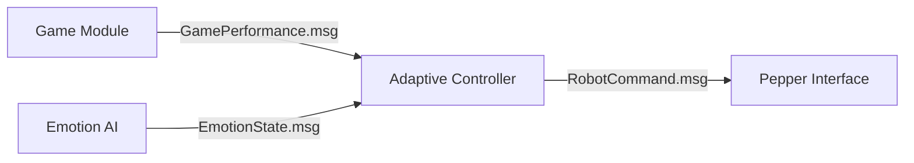

# Adaptive Behavior Controller for Social Robots

Sistema per l'interazione adattiva con pazienti anziani basato su performance cognitive e stato emotivo.

---

## Indice

* [Obiettivo](#-obiettivo)
* [Architettura](#-architettura)
* [Specifiche Comportamentali](#-specifiche-comportamentali)
* [Flusso Operativo](#-flusso-operativo)
* [Interfacce ROS](#-interfacce-ros)
* [Implementazione](#-implementazione)
* [Testing](#-testing)
* [Roadmap](#-roadmap)

---

## Obiettivo

Implementare un controller ROS che:
1. Riceve in input:
   - Livello di performance (`BASSO/MEDIO/ALTO`) dal modulo giochi
   - Stato emotivo (`NEUTRO/POSITIVO/NEGATIVO`) dal modulo AI
2. Genera output comportamentali per Pepper secondo le specifiche dell'Allegato 1:
   - Frasi di rinforzo (pag. 11-13)
   - Parametri fisici (colore occhi, gesti, tono voce - pag. 14)

---

## Architettura



---

## Specifiche Comportamentali

### Mappatura Input-Output

| Emozione  | Performance | Azione Robot                                                                 | Parametri Fisici                     |
|-----------|-------------|------------------------------------------------------------------------------|--------------------------------------|
| NEUTRO    | ALTO        | "Hai ottenuto un'ottima performance. Proviamo qualcosa di più sfidante?"     | Occhi azzurri, gesto approvante, tono 0.85-0.9 |
| POSITIVO  | BASSO       | "Il tuo atteggiamento è incoraggiante, i risultati verranno col tempo"       | Occhi verdi, braccia aperte, tono 0.85 |
| NEGATIVO  | MEDIO       | "Capisco che oggi non ti senti al massimo, ma stai lavorando bene"           | Occhi grigi, postura non minacciosa, tono 0.7-0.8 |

*Tabella completa disponibile nell'Allegato 1*

---

## Flusso Operativo

1. **Acquisizione Input**:
   - Ricezione performance via `GamePerformance.msg` (valori normalizzati 0-1)
   - Ricezione emozione via `EmotionState.msg` (dominant_emotion: stringa)

2. **Classificazione**:
   ```python
   # Esempio di classificazione performance
   if performance_score >= 0.8:
       level = "ALTO"
   elif performance_score >= 0.2:
       level = "MEDIO"
   else:
       level = "BASSO"
   ```

3. **Generazione Comando**:
   - Selezione frase casuale dalla categoria appropriata
   - Impostazione parametri fisici secondo tabella pag. 14

---

## Interfacce ROS

### Messaggi Custom

**BehaviorInput.msg**
```
string performance_level  # BASSO/MEDIO/ALTO
string emotional_state   # NEUTRO/POSITIVO/NEGATIVO
```

**RobotAction.msg**
```
string phrase            # Frase da pronunciare
string eye_color         # Azzurro/Verde/Grigio
float32 voice_tone       # Range 0.6-1.0
string gesture           # Nome gesto Pepper
```

---

## Implementazione

### Struttura Package
```
adaptive_controller/
├── scripts/
│   ├── controller_node.py       # Nodo principale Python2.7
│   └── emotion_subprocess.py    # Wrapper Python3.7 per ML
├── launch/
│   └── controller.launch
└── config/
    └── behavior_rules.yaml      # Regole da Allegato 1
```

### Codice Esempio
```python
# controller_node.py
import rospy
from shared_msgs.msg import BehaviorInput, RobotAction

class BehaviorController:
    def __init__(self):
        self.behavior_rules = load_rules_from_yaml()
        self.pub = rospy.Publisher('/robot_actions', RobotAction, queue_size=10)
        
    def callback(self, data):
        action = self.select_action(data.performance_level, 
                                  data.emotional_state)
        self.pub.publish(action)
    
    def select_action(self, perf_level, emotion):
        # Implementa logica Allegato 1
        pass
```

---

## Testing

**Scenario Tipico**:
```bash
# Terminale 1
roslaunch adaptive_controller controller.launch

# Terminale2 
rostopic pub /behavior_input BehaviorInput "MEDIO" "NEUTRO"
```

**Verifica Attesa**:
- Pepper pronuncia una frase della categoria NEUTRO/MEDIO
- Occhi diventano azzurri
- Tono voce tra 0.8-0.85

---

## Roadmap

1. **Fase 1 (Settimana 1)**:
   - Implementazione core controller
   - Integrazione base con Pepper

2. **Fase 2 (Settimana 2)**:
   - Testing con scenari reali
   - Ottimizzazione tempi risposta

3. **Fase 3 (Settimana 3)**:
   - Documentazione completa
   - Preparazione migrazione a ROS2

---

## Note Tecniche

1. **Compatibilità**:
   - Tutto il codice principale in Python2.7
   - Uso `subprocess` per parti Python3.7 (ML)

2. **Performance**:
   - Tempo massimo risposta: 500ms
   - Frequenza aggiornamento: 0.5Hz

```
